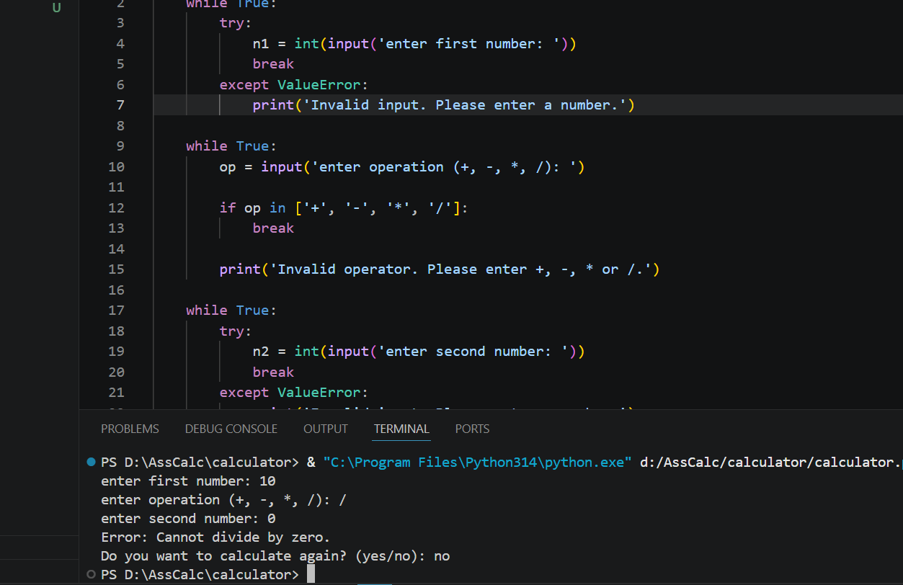

# Calculator

A simple command-line calculator built with Python.

## Features

- Addition, subtraction, multiplication, and division
- Input validation
- Division by zero handling
- Perform multiple calculations without restarting

## Technologies

- Python 3

## How to Run

Clone the repository:

git clone https://github.com/Sheriif-10/calculator.git

cd calculator

Run the application:

python calculator.py

## Example

Enter first number: 10
Enter operation (+, -, _, /): _
Enter second number: 5
10 \* 5 = 50

Do you want to calculate again? (yes/no): no
Goodbye!

## Screenshot

## Git Workflow

The project was developed using feature branches and merged into main.

Example branches:

- feature/basic-calculator
- feature/input-validation
- docs/update-readme
